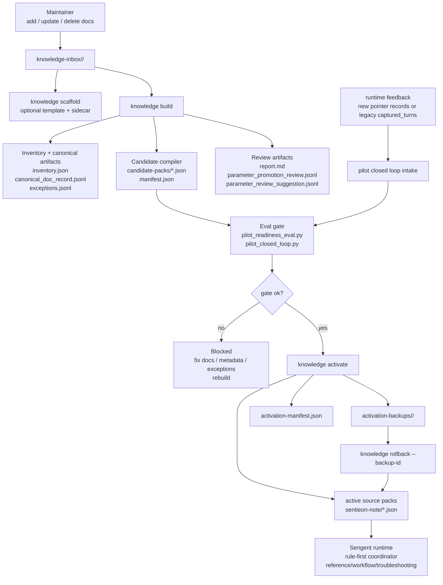

# Sengent Knowledge Build Architecture

## Purpose

Sengent 的知识库更新系统不是一个 runtime RAG 平台，而是一条离线、可评测、可回退的知识编译链。

它的目标只有三个：

1. 让维护者把原始资料安全地投递进系统
2. 把资料编译成 runtime 真正消费的 structured packs
3. 用 gate 和 rollback 保证 activation 可控

## System Diagram

## Core Principles

### 1. Build-Time Structure, Runtime Determinism

原始文档、脚本、sidecar metadata 都只存在于 build-time。

runtime 真正读取的是：

- `sentieon-modules.json`
- `workflow-guides.json`
- `external-format-guides.json`
- `external-tool-guides.json`
- `external-error-associations.json`

这保证了运行时仍然是：

- rule-first
- structured-pack-first
- eval-gated

而不是“检索到哪个 chunk 就回答哪个 chunk”。

### 2. Exception-First Build

`knowledge build` 必须把坏输入变成异常记录，而不是直接把整次 build 打崩。

因此 build 阶段的产物分成两类：

- 正常产物：inventory、canonical records、candidate packs、report
- 异常产物：`exceptions.jsonl`

维护者默认只需要看：

- `report.md`
- `exceptions.jsonl`
- parameter review artifacts

### 3. Candidate Before Active

所有变更先进入 `candidate-packs/`，绝不直接覆盖 active source packs。

只有在这几层都满足时才允许 promotion：

- build 成功
- report 可读
- pilot readiness 通过
- pilot closed loop 通过

### 4. Activation Is Reversible

`knowledge activate` 做的不是“直接生效”，而是：

1. 先备份当前 active packs
2. 再把 candidate packs 精确替换到 active source dir
3. 写 activation manifest
4. 只保留最近 3 个 backup

`knowledge rollback` 则把某个 `backup_id` 精确恢复回 active source packs。

这里的“精确”很重要：

- 需要恢复的文件必须恢复
- 不该存在的 residual pack 也必须删除

否则 rollback 只是“回拷了一部分文件”，不是可依赖的恢复机制。

### 5. Closed-Loop Must Survive Schema Evolution

runtime feedback intake 现在兼容两种记录格式：

- 新格式：`session_id + selected_turn_ids`
- 旧格式：`captured_turns`

原因很直接：closed-loop 是试点评分链路，不应该因为 feedback schema 收紧，就把历史反馈静默丢进 `pending`。

## Component Responsibilities

### `knowledge_build.py`

负责：

- 扫描 inbox
- 解析文档和 sidecar
- 产出 canonical artifacts
- 编译 candidate packs
- 生成 report / exception queue
- activation backup / rollback

不负责：

- runtime 问答
- top-level route
- 直接改变模型行为

### `cli.py`

负责：

- 暴露维护命令入口
- 解析参数
- 把 operator workflow 收口成稳定命令

当前关键命令：

- `knowledge scaffold`
- `knowledge build`
- `knowledge review`
- `knowledge activate`
- `knowledge rollback`

### `pilot_readiness.py` / `pilot_closed_loop.py`

负责：

- 把 candidate packs 或 active packs 放到同一套评测链路里
- 给 activation 提供 machine-readable gate 结果

它们不是 build compiler 的一部分，但它们是 activation contract 的一部分。

## Why This Scales

这套架构之所以能复制到别的软件支持 agent，不是因为它“用了 Docling”，而是因为它把知识更新问题拆成了四个稳定接口：

1. `raw docs`
2. `compiler`
3. `gate`
4. `activation + rollback`

只要这四层边界稳定，换一个软件产品，本质上只是在替换：

- 原始资料
- compiler 规则
- eval corpus

而不是重做整套支持系统。
