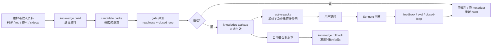
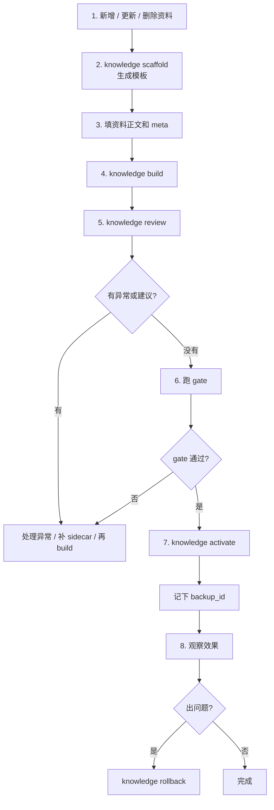

# Sengent 团队介绍简图

这份说明给团队成员做快速上手。

目标只有四个：

1. 明白系统为什么这样设计
2. 知道怎么测试系统是否稳定
3. 知道怎么新增、更新、删除知识
4. 知道发现问题后怎么反馈和回退

## 一句话理解

Sengent 不是“把文档直接丢给大模型现查现答”的系统。

它是：

- 先把资料编译成结构化知识包
- 再用规则优先的方式回答问题
- 每次更新前先做评测
- 更新后出问题还能回退

所以它的核心不是“更会搜”，而是“更稳、更可控、更容易维护”。

## 设计初衷

### 为什么不直接让模型自由发挥

因为 Sentieon 技术支持里最怕三件事：

- 参数说错
- 脚本拼错
- 把边界问题回答得像确定事实

所以 Sengent 的设计原则是：

- 先走确定性路由，再做回答生成
- 运行时主知识源是结构化 JSON pack
- 原始文档主要用于编译、校对、追溯
- 新知识必须先过 gate，再进入正式资料库

### 这套系统解决什么问题

- 让维护者不用手改 `sentieon-note/*.json`
- 让团队可以用“投资料 -> build -> review -> apply”维护知识
- 让每次更新都能测试
- 让错误更新可以回退到旧版本

## 总流程图



## 维护者日常操作图



## 团队成员要记住的 5 个动作

### 1. 新增或更新资料

先生成模板：

```bash
sengent knowledge scaffold --kind module --id fastdedup --name FastDedup
```

你会得到：

- 一份 markdown 资料模板
- 一份 `*.meta.yaml` 结构化 sidecar

然后只做两件事：

- 把资料正文放进 markdown
- 把最关键的结构化字段补进 sidecar

### 2. 删除资料

不要直接改正式资料库。

删除也走模板：

```bash
sengent knowledge scaffold --kind module --id fastdedup --action delete
```

### 3. 构建候选知识包

```bash
sengent knowledge build
```

这一步做的是：

- 扫描新资料
- 编译成候选知识包
- 产出报告
- 记录异常

注意：这一步还不会直接改正式资料库。

### 4. 查看报告

```bash
sengent knowledge review
```

重点看三样：

- `exceptions`
- candidate pack 有什么变化
- `parameter_review_suggestion`

### 5. 正式生效或回退

如果评测通过，再执行：

```bash
sengent knowledge activate --build-id <build_id>
```

如果更新后发现问题，用刚才输出的 `backup_id` 回退：

```bash
sengent knowledge rollback --backup-id <backup_id>
```

## 怎么测试系统

团队介绍时，只要把测试分成三层讲就够了。

### 第一层：单元和集成测试

```bash
python -m pytest -q
```

这层用于确认代码和知识更新流程没有明显回归。

### 第二层：readiness gate

```bash
python scripts/pilot_readiness_eval.py
```

这层用于确认系统在预设语料上的基础稳定性。

### 第三层：closed-loop gate

```bash
python scripts/pilot_closed_loop.py
```

这层用于确认：

- 对抗语料仍然稳定
- feedback 闭环可工作
- 当前知识库更新没有把整体质量拉坏

## 怎么更新知识库

把它理解成四步就行：

1. 放资料
2. build
3. review + gate
4. apply

简单版命令清单：

```bash
sengent knowledge scaffold --kind module --id <id> --name <name>
sengent knowledge build
sengent knowledge review
python scripts/pilot_readiness_eval.py --source-dir <build-root>/<build_id>/candidate-packs --json-out <build-root>/<build_id>/pilot-readiness-report.json
python scripts/pilot_closed_loop.py --source-dir <build-root>/<build_id>/candidate-packs --json-out <build-root>/<build_id>/pilot-closed-loop-report.json
sengent knowledge activate --build-id <build_id>
```

## 怎么反馈问题

团队成员如果发现回答不对，建议按这个思路处理：

1. 先确认是知识缺失、知识过期，还是路由/表达问题
2. 如果是知识问题，补资料并重新 build
3. 如果是典型坏例子，把案例补进 eval 或 feedback
4. 再跑 closed-loop，确认问题被真正收紧

一句话原则：

不是“看到错就只修代码”，而是“先补 case，再修系统”。

## 出问题怎么办

### 情况 1：build 有异常

说明资料本身或 sidecar 有问题。

处理：

- 看 `knowledge review`
- 按 report 修资料
- 重新 build

### 情况 2：gate 没过

说明候选知识包还不能正式生效。

处理：

- 不要 activate
- 看 readiness 和 closed-loop 报告
- 修资料或 metadata
- 重新 build

### 情况 3：已经 apply 后发现效果不对

处理：

- 立刻 rollback
- 恢复到上一个稳定版本
- 再排查这次新增资料哪里有问题

## 最后给团队的一句话

这套系统的设计目标不是追求“模型显得聪明”，而是追求：

- 更新可控
- 回答可追溯
- 质量可评测
- 上线可回退

只要大家记住“先 build，再 gate，后 apply；有问题就 rollback”，这套系统就会一直稳。
